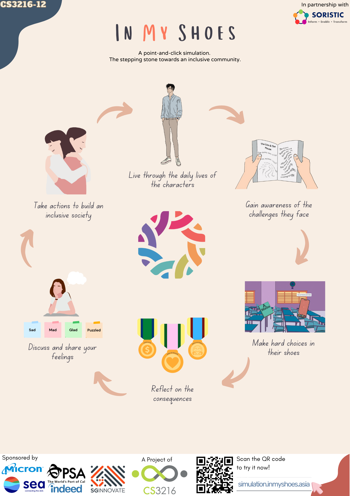

# In My Shoes

Live through the daily lives of the characters and understand the challenges they face by placing yourself in their shoes.

The In My Shoes simulation can be found [here](https://simulation.inmyshoes.asia/youth).

## Poster



## Final Project Report

The final project report can be found at `group-12-final-report.pdf` in this repository.

## Development

We use yarn for package management. When developing for the first time, run:

```bash
yarn
```

to install dependencies.

To start a dev server on port 3000, run:

```bash
yarn dev
```
